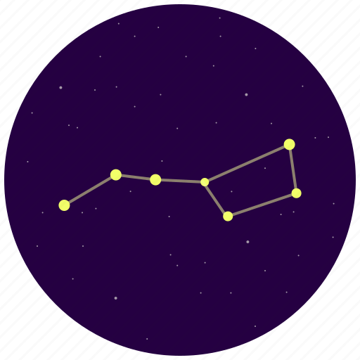

<h1 align="center">
eighty-eight
</h1>

## Repository
<a href="https://github.com/ameliaabou/laravel-app">https://github.com/ameliaabou/laravel-app</a>
## Features

This application was created with the purpose of providing people with a website where they can explore the basics of star-gazing. 
Users can learn about the 88 officially recognized constellations, read about notable celestial events happening month-by-month, download star-charts to assist with observational astronomy, add (and remove) constellations to their favorites list, and test their constellation recognition by playing a game. 
### Stack

- Laravel (in-class stack)
- (PHP, MySQL, Javascript, Blade, CSS)
- Laravel Breeze (authentication/authorization)

Styling:
- Bootstrap
- Tailwind
- Google Fonts

## Deployment

- Clone this repository
- sail artisan migrate
- sail artisan db:seed --class=ConstellationsTableSeeder
- sail artisan db:seed --class=StarChartsTableSeeder
- (optional: uses factory to create users) sail artisan db:seed --class=DatabaseSeeder
- sail up

## Take the FULL tour (Testing)
*A step-by-step guide*

#### Register
1. Press 'Don't have an account?' on the bottom of the Login form, or navigate to localhost/register
2. Enter your name and email
- An error will appear at submission if email does not match the required format 'xxx@xxx.xxx'
3. Enter your password
- An error will appear if your password is not at least 8 characters long
4. Confirm your password
- An error will appear if your passwords do not match
5. Click 'Register' to create your account.
- You will be logged in automatically.

#### Logout
1. Press the black 'Log Out' button on the nav bar to log out.
- You will be redirected to the login page.

#### Route Protection (logged out)
1. Try to navigate to localhost/, localhost/constellations, or any other established route (see web.php for other options)
- You will be redirected to the login page.
2. Try to navigate to a page that doesn't exist (try localhost/wow)
- You will be redirected to the 404 page.

#### Login 
1. Enter the email and password you registered with.
- If you enter your password wrong 3 times in a row, you will be locked out for a minute.
2. Press 'Log In'
- You will be redirected to the home page.

#### Constellations
1. Press 'Constellations' in the nav bar
- You will be redirected to the constellations page which lists all 88 constellations.
2. Scroll to view each constellation (image with name, nickname below)
3. Click on any constellation to view it in more detail
- You will be redirected to detail page which shows the constellation's nickname, image, hempsphere, season, details, and origin/mythological connections. 

#### Star Charts
1. Press 'Star Charts' in the nav bar
- You will be redirected to the star-charts page, which explains what a star chart is and how to use one, along with monthly star charts and information regarding monthly celestial events.
2. Scroll to any star chart and press 'Download (B&W)'
- A pdf with a black and white version of the star chart will be downloaded to your computer.
3. Scroll to any star chart and press 'Download (Color)'
- A pdf with a full-color version of the star chart will be downloaded to your computer.

#### Play Game
1. Press 'Play Game' in the nav bar
- You will be redirected to the constellation-game page which shows an un-named constellation and a text input bar for the user to guess the name of the constellation.
2. Guess the name of the constellation by typing it in the 'Take a guess!' field
3. Press 'Check'
- You will be redirected to the constellation-game/check page
- It will display the name of the constellation and whether or not your guess was correct. If incorrect, it will show your guess alongside the image.
4. Press 'Next' to go to the next constellation
- Note: this game is infinite and draws one of the 88 constellations randomly each time.

#### Favorites
1. Press 'Favorites' in the nav bar
- You will be redirected to the favorites page which will display all the constellations you choose to favorite
- Initially, it will show that you have no favorites. ('No Favorites :(')
2. Press 'Constellations' in the nav bar
3. Click on any constellation
4. Press 'Add to Favorites' on the constellation detail page
- You will be redirected to the favorites page, which will now show the constellation you just favorites
5. Repat steps 2-4 as many times as you'd like
- Note: constellations will not be added more than once to your favorites list
6. To remove a favorite, press the X in the top right corner of the constellation image you wish to remove from your list
- Your favorites list will be updated and will no longeer show that constellation
7. Click on a constellation in your favorites
- You will be redirected to the constellation detail page for that constellation

#### Route Protection (logged in)
1. Attempt to navigate to localhost/add-to-favorites or localhost/remove-from-favorites
- You will be redirected to the home page, no action will be done.
2. Attempt to navigate to localhost/constellation-game/check
- You will be redirected to the constellation-game page.

## That's all!
Thank you!

## License

The Laravel framework is open-sourced software licensed under the [MIT license](https://opensource.org/licenses/MIT).
